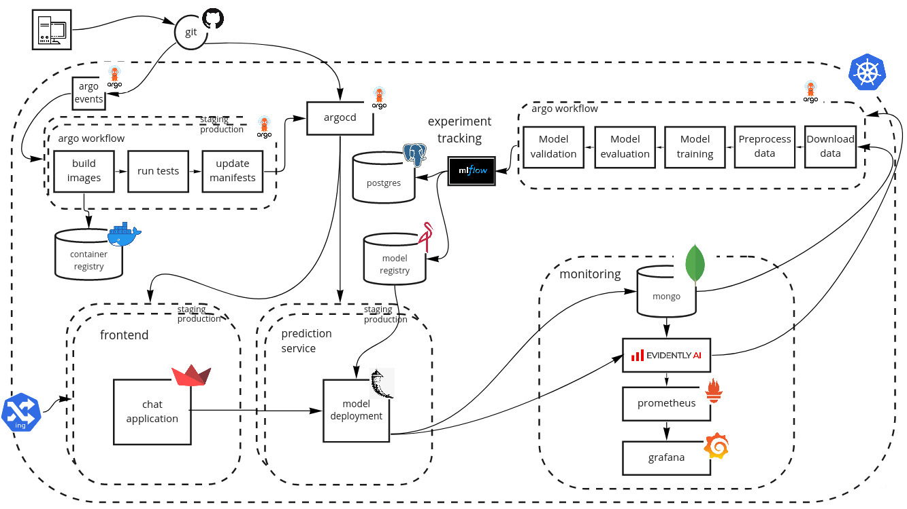
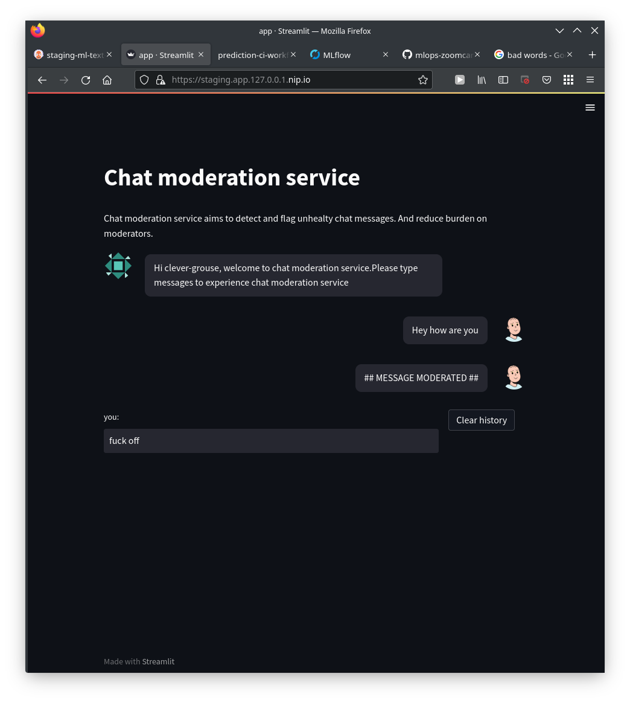
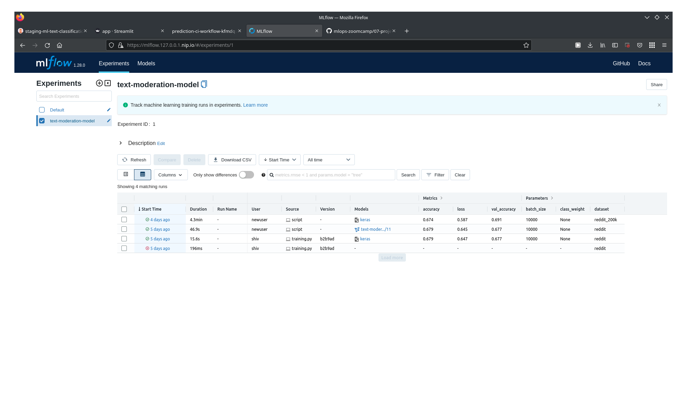
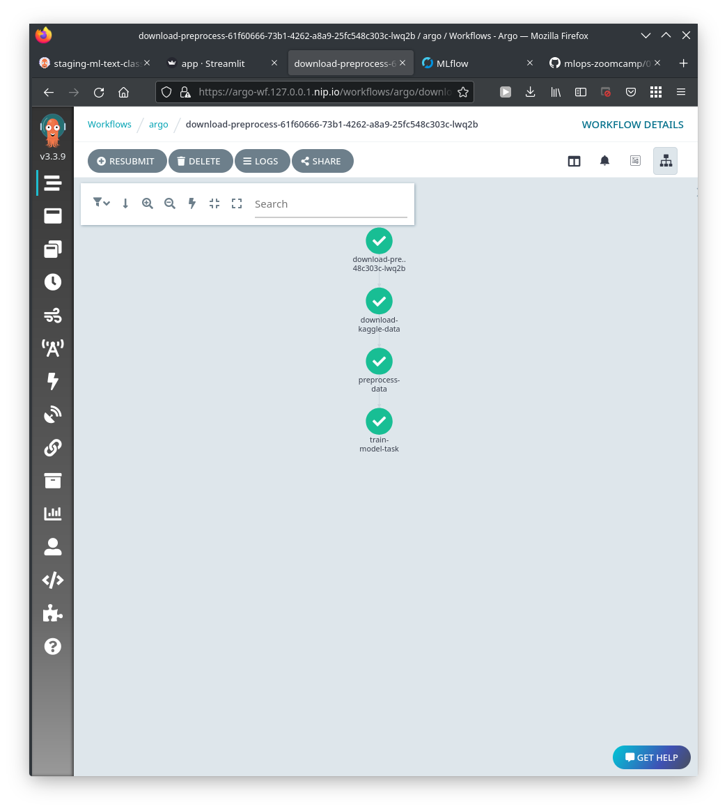
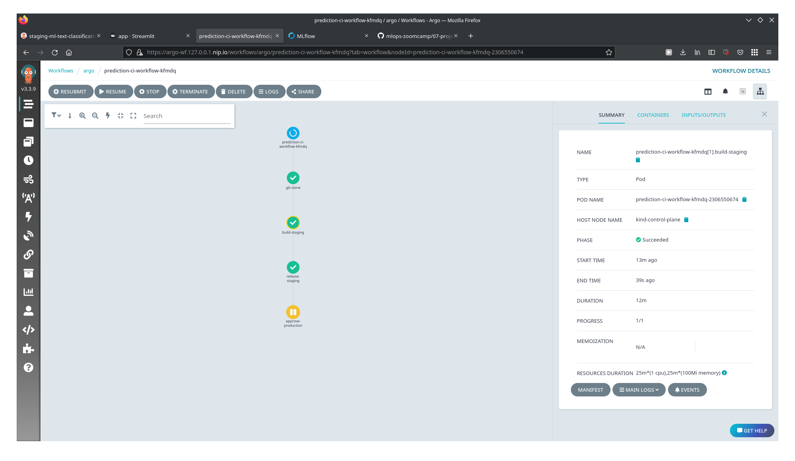
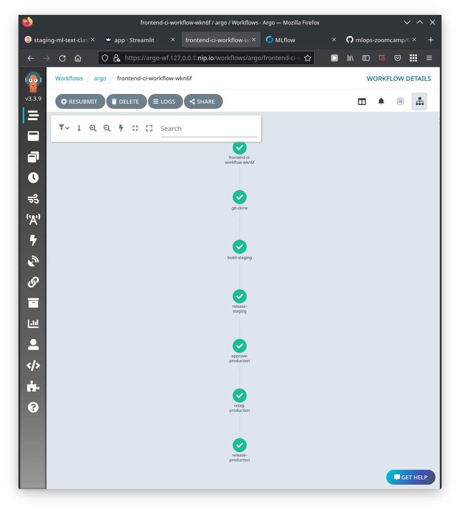
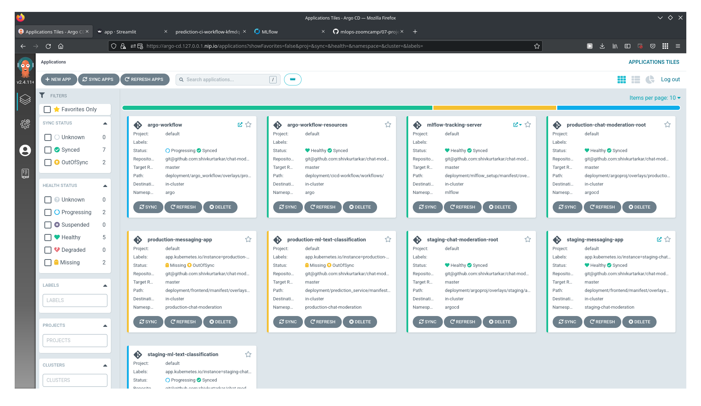

# chat-moderation


### Problem Description:
Everyone uses social networking platforms to interact over a long distance or to stay connected. With the invention of social networking platforms, the world has become more intimate, accessible, and connected. But recently we have seen over amplification of negative activities on these platforms. Online bullying, scams, and fraud have become easier to perform. Easy accesibility of these platforms by young generation, lack of understanding of thechnicalities of attacks by older generation and democratization of advance technologies as soon as they are invented (like deep fakes whoes full capability might not be yet be known)  makes it further alarming situation. Hence there is a growing need for better real-time message moderation to alert the platform owners who can take action to keep their users safe. Keeping users safe helps develop a healthy community where everyone can feel safe to share their genuine thoughts and open them up for collaboration with all.



This is an implementation of Chat moderation part of a group chat application. The project provides a dummy chat applicaiton and online service for predicting if a text sent needs moderation. Models have been trained on [rscience-popular-comment-removal](https://www.kaggle.com/datasets/areeves87/rscience-popular-comment-removal?resource=download) dataset from kaggle.

Focus of these project is to build production machine learning service with experiment tracking, pipeline automation, observability and ci/cd rather than building the most accurate prediction model.

## Technical details

- Deployment platform: kubernetes,
- Experiment tracking: mlflow, minio, postgres
- Workflow orchestration: argo workflow, hera (for making it simple to submit workflows)
- CI/CD: github, argo workflow, argocd
- Monitoring: prometheus + graphana (not implemented yet)


#### High level overview

Project started with jupyter notebook in modeling dir.
After building models, they are converted into a workflow. Argo workflow is used for handling pipeline and Hera python library is used to submit the the workflow. Workflow scripts are in workflow directory. Each step of pipeline has corresponding python file, download_datatset,  preprocess, training, and evaluation. workflow.py combines them all as a workflow.
For experiment tracking mlflow is been used. Mlflow is connected to postgres for storing experiment metadata and minio as model repository.
Best model is deployed as flask api service while Chat ui is build using strimlit. both of these are located in deploymet/prediction_service and deployment/frontend respectively.
Argocd is used for deploying applications and argo worflow is used for ci workflow. Ci templates can be found in deployment/cicd-workflow dir.
All applications are described in yaml for argocd under deployment/argoproj. deployment/argoproj/infra points to all yaml for all tools including argocd, argoworkflow, mlflow, minio, postgres which plays supporting role.
Precommit config and project configs are under in root directory.
Make file is been used to make it easy to build and run code locally.
Unit tests and integration tests are written only for prediction service.

## Pictures

Frontend showing chat moderation system flagging the message.
<br>
<br>


Mlflow dashboard showing experiment results
<br>
<br>


Training workflow submitted to argoworkflow using hera.
<br>
<br>


CI workflow waiting for approval to push deployment to production
<br>
<br>


CI workflow after full deployment
<br>
<br>


Argocd managing deployed applications.
<br>
<br>

## Quick start
I have provided 2 setups
1. Standalone deployment where only ui and model is hosted
2. Full deployment where ci/cd, training workflow, experiment tracking server and staging and production builds are deployed.


## Prerequisite
### Create kind cluster
```
kind create cluster --config kind.config
```

### setup nginx Ingress
```
kubectl apply --filename https://raw.githubusercontent.com/kubernetes/ingress-nginx/master/deploy/static/provider/kind/deploy.yaml
kubectl wait --namespace ingress-nginx   --for=condition=ready pod   --selector=app.kubernetes.io/component=controller   --timeout=90s
```

### setup argo-cd
```
kubectl apply -k  deployment/argo-cd/overlays/production/
```
use http for just deployment
or fork and use ssh credentials for full setup with pipeline and cicd
update credentials in argocd-repo-creds.yaml
setup repository credentials
```
kubectl apply -f argocd-repo-creds.yaml
```
access argocd at https://argo-cd.127.0.0.1.nip.io


## A. To run standalone
Setup repo credentials
```
kubectl apply -f argocd-repo-creds.yaml
```
deploy standalone
```
kubectl apply -k deployment/argoproj/overlays/standalone/
```
access the app at https://standalone.app.127.0.0.1.nip.io

## B. For full setup

fork the repo and
update the repo url using following sed command.
Please note repo url needs to be set according to login method you intend argocd to use. (current ci/cd pipeline setup doesnt support https)
```
find ./ -type f -exec sed -i -e 's+git@github.com:shivkurtarkar/chat-moderation.git+forkedrepo_name+g' {} \;
```

Update docker repository name
```
find ./ -type f -exec sed -i -e 's+shivamkurtarkar+dockerhub_accout_name+g' {} \;
```

Fill out argocd-repo-creds.yaml. I have provided template for https and ssh login.

Create secrets
1. Docker credentials for pushing images
Generate base 64 encoding of your docker credentials
```
cat ~/.docker/config.json | base64 -w0
```
Create secret file as secrets.yaml with following
```
apiVersion: v1
kind: Secret
metadata:
  name: regcred
data:
  .dockerconfigjson: <base-64-encoded-json-here>
type: kubernetes.io/dockerconfigjson
---
apiVersion: v1
data:
  config.json: <base-64-encoded-json-here>
kind: Secret
metadata:
  name: argo-regcred
  namespace: argo
```
2. github ssh key for pushing code after updating manifest by ci/cd pipeline
```
kubectl create secret generic github-creds \
  --namespace=argo \
  --from-literal=ssh-privatekey=<ssh-key> \
  -o yaml

```

Build mlflow docker by running build_docker.sh inside mlflow_setup

Deploy the infra structure
```
kubectl apply -k  deployment/argoproj/infra/
```
deploy secrets
```
kubectl apply -k  secrets.yaml
```

This will deploys argo workflow, mlflow tracking server, minio as artifact store and ci/cd workflow templates.

To Access these use following links<br>
argo workflow at https://argo-wf.127.0.0.1.nip.io <br>
minio at https://minio.127.0.0.1.nip.io <br>
mlflow at https://mlflow.127.0.0.1.nip.io

Run the following commands to deploy staging and production applications
```
kubectl apply -k  deployment/argoproj/overlays/staging/
kubectl apply -k  deployment/argoproj/overlays/production/
```

Access these at following links<br>
staging at https://staging.app.127.0.0.1.nip.io/ <br>
production at  https://prod.app.127.0.0.1.nip.io/


### run workflow
Generate kaggle keys from kaggle account and use them to generate secret
This will be used to download the dataset
```
kubectl -n argo  create secret generic kagglekeys --from-file=kaggle.json
```

To submit workflow
```
cd workflow
python -m pipenv install
python -m pipenv shell
make argo_workflow
```

From argo workflow ui
you can trigger ci/cd workflows for prediction service and frontend
For automated workflow argo events needs to be setup.


To install precommit hooks run
```
pre-commit install
```


## Scope for improvement
1. Argo events for automated ci/cd trigger
2. monitoring system
3. Retrain and send an alert when data/target drift are detected
4. Add IaC
5. Building better model <br> few more datasets for explorations
-   [jigsaw-toxic-comment-classification-challenge](https://www.kaggle.com/competitions/jigsaw-toxic-comment-classification-challenge/code)<br>
-   [malignant-comment-classification](https://www.kaggle.com/datasets/surekharamireddy/malignant-comment-classification?select=train.csv)<br>
-   [reddit-comment-score-prediction](https://www.kaggle.com/datasets/ehallmar/reddit-comment-score-prediction)<br>
6. Dashboard for debuging models and insigts
